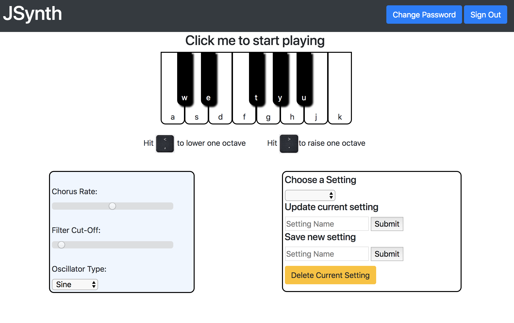
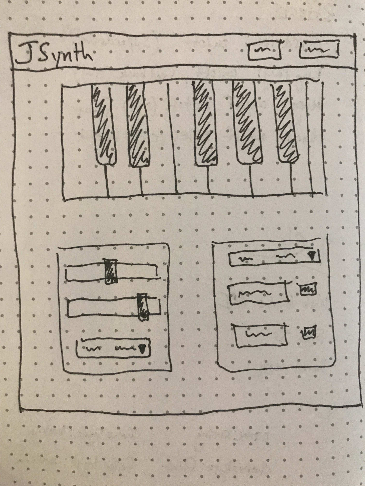

# Welcome to JSynth!

##### JSynth is a synthesizer web browser application that allows you to play a synthesizer using your computer keyboard. Simply log in, click on the piano and start playing! Also, check out the different effects settings. When you like what you have, save the setting to use later.

### Links:
* [API repo](https://github.com/j-gottlieb/jsynth-api)
* [Client repo](https://github.com/j-gottlieb/jsynth-jquery-client)
* [Deployed API](https://jsynth-api.herokuapp.com/)
* [Deployed Client](https://j-gottlieb.github.io/jsynth-jquery-client/)

### Technologies:

* Javascript
* JQuery
* Web Audio API
* [tunajs](https://www.npmjs.com/package/tunajs)
* Bootstrap
* Ruby
* Ruby on Rails
* ajax

### Unsolved Issues:

* Newly saved settings do not automatically update the oscillator-type dropdown when selected by the user.

* I would like the user to be able to adjust settings in real time while playing the synth, rather than clicking out and back in. The reason for this feature was to prevent extraneous notes from playing while typing into forms on the page, but I think it would be better to change the event listeners to err on the side of allowing the playing to continue.

### Planning:

Planning for JSynth began during thanksgiving week. I originally thought building a synth was a little beyond the scope of this project, but after having some success during practice runs in between the pie and booze, I decided to give it a whirl.

From the beginning I had a clear idea of the layout of the page. It would put the piano keyboard front and center with effects settings being a very simple and intuitive interface.

Using the react-auth template I built a synth component that succesfully rendered a playable synth, but it kept causing memory leaks that crashed the browser tab. At the time I believed this was a react issue and not, as I later learned, a web audio api bug. Based on advice from my instructor, I moved away from React, back to a standard jquery browser template. Ironically, I encountered the same bug in the new template and eventually solved it using info from a stack-overflow post.

With a functioning synth, it was a matter of designing the ui so that it wouldn't overwhelm the user with information. I wanted it to be easy to use out of the box, so there are very few instructions on the screen.

### Set-up and Installation:

1. Download and unzip browser template
2. Initialize and create remote git repo
3. npm install
4. npm install tunajs

### User Stories:
A user can:
1. Create an account
2. Log in
3. Change password
4. Log out
5. Play a synthesizer
6. Adjust effects settings including, chorus, filter and waveform type
7. Save effects settings
8. Update effects settings
9. Delete effects settings
10. Recall Effects settings

### Wireframe:

